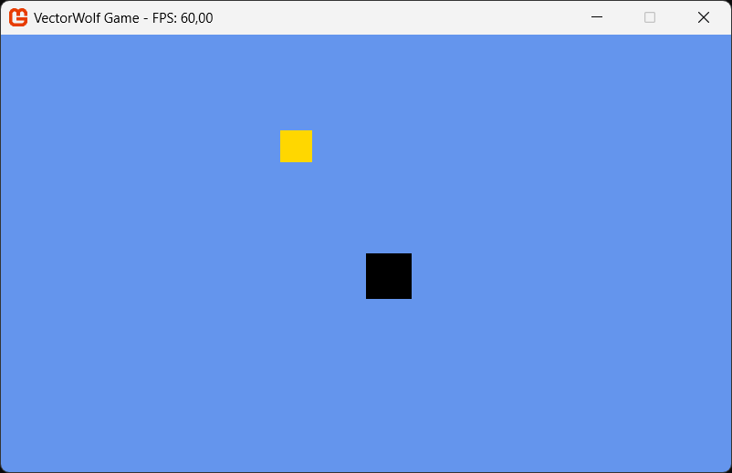

# VectorWolf

**VectorWolf** is a small, lightweight game engine/framework I built primarily for making my own games. It's simple, modular and gives you full control.

## Features

- **Scene-Entity-Component structure**  
- **Rendering system** with an API for custom renderers  
- **Easy to extend** – modular and flexible structure
- **Ogmo Editor support** - import Ogmo Tilemaps and Scenes

## Why?

I wanted a minimal engine without the complexity of larger tools. VectorWolf is a personal project, but feel free to use it or contribute if you find it helpful!

## Getting Started


Simply add the NuGet package to your `.csproj` like this:

```xml
<PackageReference Include="VectorWolf" Version="0.1.0" />
```
VectorWolf doesn't have any official documentation yet, but you can take look at the VectorWolf.Test project and at the source of VectorWolf itself. If I create any more examples i will link them here.

## VectorWolf.Test
a very basic "coin" collector game


